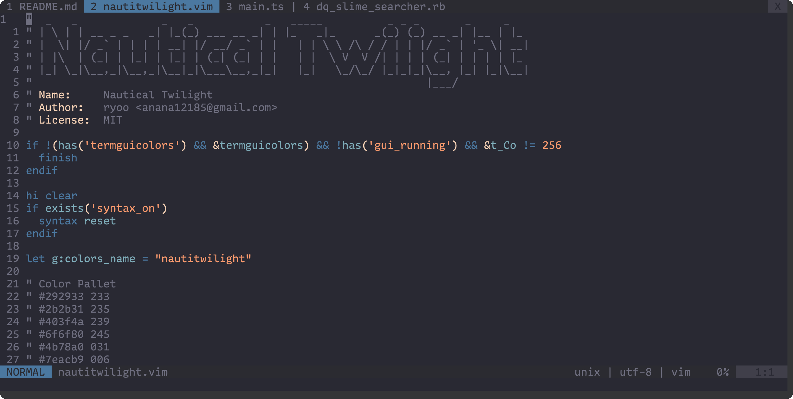
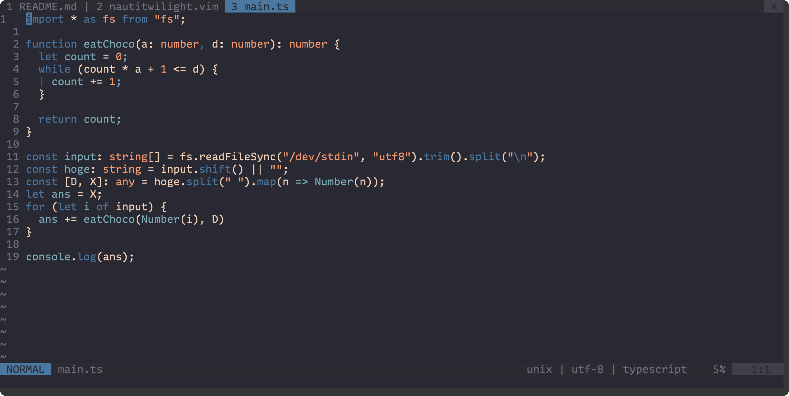
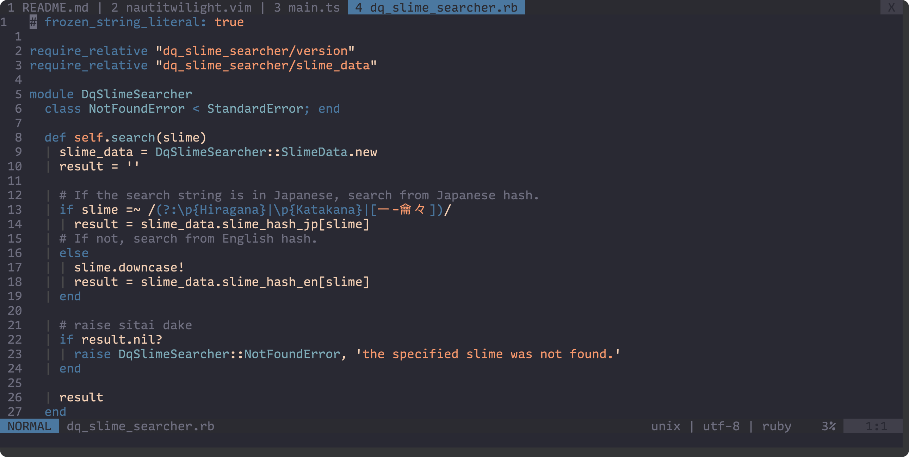

# Nautical Twilight

nautitwilight.vim is colorscheme for Vim inspired by [Nautical twilight](https://www.timeanddate.com/astronomy/nautical-twilight.html).  

## Screen shot






## Features

- Several filetypes(TypeScript, Ruby, etc)
- 256 Colors
- Terminal Colors
- Status Line([itchyny/lightline.vim](https://github.com/itchyny/lightline.vim))

## Installation

Use [junegunn/vim-plug](https://github.com/junegunn/vim-plug).

```vimscript
Plug 'ryoo14/nautitwilight.vim'
```

Edit your .vimrc.

```vimscript
set termguicolors
set background=dark
colorscheme nautitwilight
```

If you use [itchyny/lightline.vim](https://github.com/itchyny/lightline.vim), edit as below.

```vimscript
let g:lightline = {'colorscheme' : 'nautitwilight'}
```

## License
MIT
