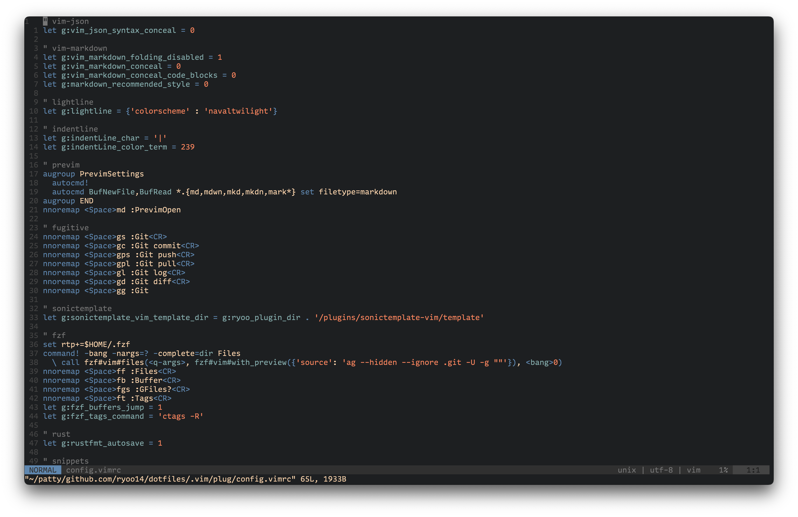

# Nautical Twilight

nautitwilight.vim is colorscheme for Vim inspired by twilight.  
This project is WIP.
I envision the sky as below at twilight.  
[GANREF](https://ganref.jp/m/uruma-neo/portfolios/photo_detail/238297)

## Screen shot

## Features
It only support [lightline.vim](https://github.com/itchyny/lightline.vim).

## License
MIT

